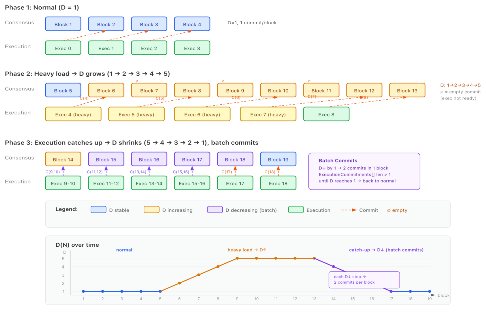

# Async Execution

Conventional blockchains interleave execution with consensus: a block proposal carries the post-execution state root, so the leader must execute before proposing and every validator must re-execute before voting. The consequences compound: execution runs twice per block, the gas limit is sized against the slowest node's worst case, and the execution budget shrinks to a fraction of the block time.

At a 200 ms block interval, that architecture isn't viable. BNB NewL1 decouples the two concerns: consensus establishes transaction ordering without executing anything, and execution proceeds asynchronously, several blocks behind. Since a deterministic ordering fully determines every outcome, execution reveals state rather than deciding it.

## How It Works

- **Ordering (slot N).** Static validation and the [BLS vote](./consensus.md) that finalizes transaction order, with no execution.
- **Execution (slot ≥ N+1).** Transactions execute asynchronously, and the result is written into a later block's header as an `ExecutionCommitment`.

Concretely, a `NewL1Header` carries the fields known at proposal time, including the transaction list, but omits everything that can only be computed by running the block: `state_root`, `receipts_root`, `logs_bloom`, `gas_used`, `blob_gas_used`, and `requests_hash`. Those values are published later, in execution commitments attached to a subsequent block. Execution itself runs off the hot path: a scheduler picks up imported blocks, runs the EVM work in the background, and produces the real post-execution state when it's done, independent of the block-production and voting loop.

## Adaptive Execution Lag

Block `N`'s results land in the header of block `N+D`. Prior designs fix `D` (EIP-7886 at 1, Monad at 3) and pay worst-case latency at all times. BNB NewL1's `D` adapts to load:

- **Low load.** `D` shrinks toward 1, minimizing time to finality.
- **High load.** `D` grows, absorbing backlog without stalling consensus.
- **Catch-up.** One block may carry several `ExecutionCommitment`s, draining the backlog in batches.



Constraints: `1 ≤ D(N) ≤ D_MAX`, at most ±1 change per block, with `D_MAX` [governance-configurable](../governance/overview.md). Validators don't re-derive the proposer's exact lag; they enforce the structure of the commitment list: entries must be contiguous from the previous commitment, strictly increasing, and advance by a bounded amount per block.

## Block States

Decoupling means a block no longer goes from "proposed" to "final" in one hop: ordering can be settled while the execution result is still in flight. Each block moves through four states:

```
 ordered ────────► executed ────────► committed ────────► finalized
 slot N            slot N+D           header of           committing block
 block produced    local EVM run      block N+D           BLS-voted
 └─ consensus ─┘   └────────────── execution lane ──────────────┘
```

- **Ordered.** The block is produced and transactions are packed in a fixed order.
- **Executed.** The EVM has run the block's transactions locally.
- **Committed.** The execution result appears in a later block's header as an `ExecutionCommitment`.
- **Execution finalized.** The committing block is itself voted in, completing execution finality.

Ordering alone never finalizes a block; finality requires the execution result to be committed on-chain and voted on. Reorgs roll back ordering and execution atomically.

## Paying for Block Space

Consensus admits transactions against a `D`-lagged view of state, so a transaction can pass every ordering-time check and still be guaranteed to fail at execution. Unmitigated, that puts calldata on-chain without anyone paying for it:

| Vector | Mechanism |
|---|---|
| Zero-balance spam | Account drained after the `D`-lagged snapshot; the transaction clears consensus, fails at execution. |
| Intra-block drain | One transaction drains an account; a second, calldata-heavy one still appears funded against stale state. |
| Nonce conflicts | Collisions inside the `D`-window are invisible to static checks. |
| Contract dependencies | Approvals and balances shift between ordering and execution; static checks can't see it. |

BNB NewL1 tracks each account's cumulative in-flight spend across the `D`-window and derives an `effectiveBalance` from it, enforced by four rules:

1. **Fee on gas limit.** The sender pays `gas_bid × gas_limit` regardless of actual usage. Unused-gas refunds are disabled and EIP-3529 refunds are voided, so blocks are packed on declared gas, which is the block space actually sold. (System transactions and RPC simulations keep standard refund behavior; see [Migrating from BSC](../get-started/migrate-from-bsc.md#you-pay-for-your-declared-gas-limit).)
2. **Consensus-time solvency.** A transaction is admitted only if `effectiveBalance ≥ tx_cost`.
3. **Execution-time settlement.** Transactions that become unpayable, or hit a nonce mismatch, fail rather than execute. If the nonce is correct, the payer is charged `min(balance, occupied × price)` and the nonce is consumed; if the nonce is invalid, no charges or state changes occur, preventing malicious replays. Either way the receipt consumes `min(gas_limit, remaining block gas)`, so invalid transactions never occupy free block space.
4. **Per-account in-flight caps.** Hard limits on cumulative `gas_limit` and calldata bytes per account within the `D`-window.

Only an account's own transactions can spend its native balance, so this accounting is exact rather than heuristic, and no fixed reserve floor is needed, unlike Monad's reserve-balance approach.

## System Transactions

Interleaved chains build and sign system transactions (validator-set updates, reward distribution, slashing) at proposal time, because execution results are already on hand. On BNB NewL1 those results don't exist until slot `N+D`, so system transactions don't exist at ordering time at all. They are generated during execution, and their effects land in the block's `ExecutionCommitment`. Validators order and vote on user transactions only.

## State Commitment

Decoupling makes execution the throughput bottleneck, so what execution spends its budget on starts to matter. BNB NewL1 commits state with a cumulative lattice-hash accumulator (LtHash) over a flat key-value store: advancing it costs O(1) per changed entry no matter how large the state is, and because it is cumulative, any divergence propagates into every descendant commitment.

That choice is what makes `eth_getProof` and snap sync unavailable. See [State DB](./state-db.md) for the construction, the storage layout, and the full list of consequences.

## Correctness Enforcement

Because ordering and execution are decoupled, a fast-finality vote is fundamentally a vote on ordering, not on someone else's claimed execution result. The correctness check happens elsewhere: a validator abstains from voting for a head whose published execution commitments its own local execution disproves. Since the state commitment is cumulative, a bad result is reliably caught within a bounded number of blocks, and an incorrect execution result cannot gather the ⌈2N/3⌉ votes it needs to finalize, even though block import itself doesn't reject it outright (rejecting at import would break the ability for later blocks to resolve their parent while execution is still catching up).

## For Developers

Three block-height concepts exist side by side, and all three are reachable through standard Ethereum block tags, with no custom tag strings or custom height methods on the wire:

| Concept | How to read it | Meaning |
|---|---|---|
| Executed | `eth_blockNumber` (no params, or `latest`/`pending`) | Latest block whose EVM execution has actually completed locally |
| Finalized | `eth_blockNumber("finalized")` (or `"safe"` for justified) | Latest published execution commitment at or before the finalized block, meaning a two-thirds BLS vote quorum (see [Consensus](./consensus.md)) |
| Ordered | The `number` field on `newl1_subscribeNewHeads` / `eth_subscribe("newHeads")` | Latest block whose transaction order is settled |

The executed tip trails the ordered tip by `D`, normally a small number of blocks.

Practical guidance:

- A transaction's ordering is settled quickly, but execution-derived data (state, receipts) for the *very latest* blocks lags behind it. You rarely have to think about this: `latest` and `pending` both resolve to the executed tip, so an ordinary read never returns pre-execution state and never fails with "not yet executed". Asking for an explicit block number that is ordered but not yet executed is what returns `-38004`, so retry rather than treating it as an error.
- Only blocks that are both canonical and finalized are persisted to disk; the unfinalized window lives in memory. That is why finalized, rather than merely ordered, is the right bar for anything that shouldn't ever be revisited.

## Current Status

The async execution pipeline is live and running today on the devnet, on top of the [LtHash state commitment](./state-db.md).

## What's Next

Decoupling consensus from execution gives the EVM a dedicated processing window; parallel execution is what will maximize throughput inside it. The current design centers on an access-list-based parallel EVM: transactions declare their state dependencies explicitly, so non-conflicting transactions can execute concurrently. Detailed design is in progress.
