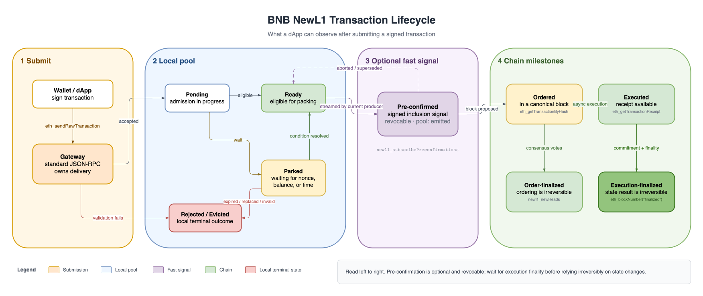

# Transaction Lifecycle

A transaction progresses from submission to pool admission, optional pre-confirmation, ordering, execution, and finality. Each milestone has a specific RPC signal; this page explains which one a dApp should use.



## 1. Submit through a Gateway

A **Gateway** is a full node used as a transaction-submission edge. A dApp sends an ordinary signed transaction to its standard JSON-RPC endpoint; there is no Gateway-specific transaction format or client RPC.

```bash
curl -X POST "$RPC" -H "Content-Type: application/json" \
  --data '{"jsonrpc":"2.0","method":"eth_sendRawTransaction","params":["0xSIGNED_TX"],"id":1}'
```

After accepting the transaction, the Gateway keeps custody of it and sends replicas directly to the upcoming block producers selected from the validator schedule. A producer may pack its replica, but does not forward it again. This single-hop routing replaces global mempool broadcast.

From a dApp's perspective, the Gateway is simply the RPC endpoint responsible for delivery:

- Submit once with `eth_sendRawTransaction` and save the returned hash.
- Use the same transaction-status and chain RPCs described below.
- Avoid submitting the same transaction to several Gateways by default. Each accepting Gateway becomes an independent custodian, creating duplicate delivery streams rather than making the transaction inherently faster.

The current client exposes no Gateway-specific auction or ordering API. Gateway describes the node's routing role, not an additional on-chain transaction stage.

A transaction that fails validation is rejected immediately. It never enters the pool, and the submission RPC returns the rejection reason.

## 2. Pool states

Once accepted, the transaction enters the receiving node's local pool. Its sender nonce determines when it becomes eligible for packing.

| Pool state | Meaning |
|---|---|
| `pending` | The node has accepted the transaction and is completing admission. This state is normally brief. |
| `parked` | The transaction cannot be packed yet, usually because of a nonce gap, a future validity window, or insufficient available balance. |
| `ready` | The transaction is contiguous with the sender's ordered nonce and currently eligible for packing. |
| `emitted` | The transaction is in a streamed sub-block slice. This is still a local-pool state; use the pre-confirmation API for the signed event. |
| `ordered` | The transaction is in a block known to this node. It remains tracked until finality allows pool cleanup. |
| `evicted` / `removed` / `rejected` | The transaction left the local pool or failed admission. Check `reason` for the terminal cause. |
| `unknown` | This node has no retained information. It does not prove that the network never saw the transaction. |

A parked transaction can become ready when its nonce gap is filled, its validity window opens, or new funds become available. A reorganization can also move an ordered transaction back into an eligible pool state.

### `newl1_getTransactionStatus`

Returns this node's retained pool-plane view of one hash:

```bash
curl -X POST "$RPC" -H "Content-Type: application/json" \
  --data '{"jsonrpc":"2.0","method":"newl1_getTransactionStatus","params":["0x…"],"id":1}'
```

```json
{
  "state": "emitted",
  "reason": null,
  "sender": "0x…",
  "nonce": "0x2a",
  "ageMs": "0xc"
}
```

`reason` is set for terminal states such as `rejected`, `evicted`, and `removed`. Common values include `nonce_gap`, `replacement_underpriced`, `ttl`, `invalid`, `replaced`, and `dual_confirmed`. `sender`, `nonce`, and `ageMs` are `null` when the state is `unknown`.

This result is node-local. With no global mempool, another node may return a different state or `unknown`. `unknown` also covers a result that aged out of the bounded status history; it is not a negative network-wide outcome.

### `newl1_debugSenderSnapshot`

Use the debug snapshot when you need to explain why one sender's transactions are not progressing:

```bash
curl -X POST "$RPC" -H "Content-Type: application/json" \
  --data '{"jsonrpc":"2.0","method":"newl1_debugSenderSnapshot","params":["0xSENDER"],"id":1}'
```

```json
{
  "sender": "0x…",
  "baseAtExecutedTip": "0x28",
  "orderedNonce": "0x2a",
  "entries": [
    {"nonce": "0x2a", "hash": "0x…", "state": "emitted", "ageMs": "0xc"}
  ]
}
```

`baseAtExecutedTip` is the sender nonce at the executed tip; `orderedNonce` includes canonical transactions that may not have executed yet. Entries are returned in nonce order.

### Default pool rules

These are node defaults; operators can change them.

- Future nonces may be at most 256 ahead of the current sender nonce.
- A replacement must increase the effective tip by at least 10%, with a strict minimum increase of 1 wei.
- A forwarded replica cannot replace a transaction received directly from a client.
- Pool TTL defaults to 3 hours and the maintenance scan runs every 20 seconds.

## 3. Receive a pre-confirmation

During its turn, the current block producer repeatedly packs ready transactions into signed sub-block slices. When a slice containing your transaction is broadcast, observers report it as `preconfirmed`.

A pre-confirmation provides a fast ordering and inclusion signal, not an execution result or finality guarantee. It may later become:

- `aborted` if the producer withdraws its stream; or
- `superseded` if another block takes the height.

Treat either event as revocation and continue tracking the transaction. Do not release funds or settle irreversible work from a pre-confirmation alone.

### Subscribe over WebSocket

```json
{"jsonrpc":"2.0","method":"newl1_subscribePreconfirmations","params":[{"txHash":"0x…"}],"id":1}
```

The filter is optional; `params: []` subscribes to every transaction. Notifications use method `newl1_preconfirmation` and contain:

```json
{
  "txHash": "0x…",
  "blockNumber": "0x961",
  "parentHash": "0x…",
  "subBlockIndex": "0x2",
  "subBlockHash": "0x…",
  "position": "0x7",
  "leader": "0x…",
  "timestampMs": "0x…",
  "status": "preconfirmed"
}
```

`status` is `preconfirmed`, `aborted`, or `superseded`. If the subscriber falls behind, it receives `{"status":"lagged","dropped":N}`; perform a one-shot lookup to resynchronize.

### One-shot lookup

```bash
curl -X POST "$RPC" -H "Content-Type: application/json" \
  --data '{"jsonrpc":"2.0","method":"newl1_getTransactionPreconfirmation","params":["0x…"],"id":1}'
```

The cache retains at most 8,192 events spanning at most 80 blocks. A `null` result therefore means “not in this node's current cache,” not “never pre-confirmed.”

`newl1_subscribeSubBlocks` exposes the raw signed slices for clients that verify the producer signature and transaction root themselves. The producer explicitly feeds its own published slices to local subscribers, so these subscriptions also work against the producer's RPC and on a single-node devnet.

See [Transaction Pre-confirmation](../core-concepts/tx-preconfirmation.md) for the verification flow.

## 4. Order, execute, and finalize

After the producer seals and proposes the block, ordering, execution, and their finality signals advance on separate paths:

| Milestone | What it proves | How to observe it |
|---|---|---|
| **Ordered** | The transaction has a fixed position in an imported canonical block. It may still be reorganized before finality. | `eth_getTransactionByHash` returns non-null `blockHash` and `blockNumber`. |
| **Executed** | The EVM has run the transaction and produced its receipt and state changes. | `eth_getTransactionReceipt` |
| **Order-finalized** | Two-thirds of validators have voted for the containing block, making its ordering irreversible. | Compare the transaction's block number with `finalizedNumber` from `newl1_subscribeNewHeads`. |
| **Execution-finalized** | The execution result has been committed in a later block, and that committing block is finalized. | Wait until the transaction's block number is at or below `eth_blockNumber("finalized")`. |

`eth_getTransactionByHash` also returns transactions still held in the queried node's local pool. A non-null result proves ordering only when `blockHash` and `blockNumber` are populated.

Execution is asynchronous, so an ordered transaction may not have a receipt yet:

- `eth_getTransactionReceipt` returns **`-38004`** when the transaction is ordered but not yet executed. Retry.
- It returns **`null`** when the hash is unknown. This is not an execution-lag signal.

BNB NewL1 extends `eth_blockNumber` with an optional tag parameter:

| Call | Result |
|---|---|
| `eth_blockNumber()` / `eth_blockNumber("latest")` / `eth_blockNumber("pending")` | Executed tip |
| `eth_blockNumber("safe")` | Latest published execution commitment at or before the justified block |
| `eth_blockNumber("finalized")` | Latest published execution commitment at or before the FFG-finalized block |
| `eth_blockNumber("earliest")` | Block 0 |

The `safe` and `finalized` values are commitment-backed execution heights, not the raw consensus pointers. For the raw ordered, justified, and finalized heights, subscribe to `newl1_subscribeNewHeads`; standard `eth_subscribe("newHeads")` follows the executed-block feed instead.

```json
{"jsonrpc":"2.0","method":"newl1_subscribeNewHeads","params":[],"id":1}
```

Each `newl1_newHeads` notification carries:

```json
{
  "hash": "0x…",
  "number": "0x961",
  "justifiedHash": "0x…",
  "justifiedNumber": "0x95f",
  "finalizedHash": "0x…",
  "finalizedNumber": "0x95e"
}
```

See [Async Execution](../core-concepts/async-execution.md) for how the ordered, executed, and committed tips relate.

For anything that depends only on transaction order, order finality is sufficient. For anything that depends on execution success or state changes, wait for execution finality and re-check that the canonical block hash still matches the transaction's `blockHash`.

## 5. Leave the local pool

A transaction is removed from a node's pool when any of the following happens:

- both execution and finality have advanced far enough to clean it up (`reason: "dual_confirmed"`);
- another transaction with the same sender and nonce replaces it with a sufficiently higher fee;
- a chain-state change makes its nonce or balance invalid; or
- it exceeds the local pool TTL.

Replacement and eviction are local to the nodes that hold the transaction. A local `evicted`, `removed`, or `unknown` result is therefore not a network-wide failure signal; check canonical inclusion before deciding whether to resubmit.

## Recommended tracking flow

1. Save the hash returned by `eth_sendRawTransaction`.
2. Optionally watch pre-confirmations for a low-latency, revocable signal.
3. Poll `eth_getTransactionByHash` until the transaction is ordered.
4. Poll `eth_getTransactionReceipt`; retry `-38004` while execution catches up.
5. Wait for the transaction's block to fall at or below `eth_blockNumber("finalized")` before relying irreversibly on its execution result.
6. Use `newl1_getTransactionStatus` only to explain the local pool path, not as the source of chain finality.

For runnable commands that follow this sequence, see [Examples](./examples.md#follow-one-transaction-through-every-stage).
