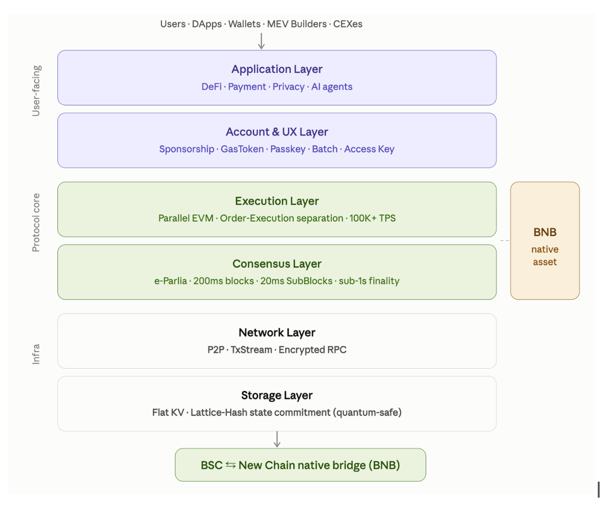

# BNB NewL1 — High-Performance EVM L1

BNB NewL1 is a high-performance, EVM-compatible Layer 1 blockchain, and the newest member of the BNB Chain family. It targets workloads that reward sub-second finality, near-instant pre-confirmation, reserved capacity for latency-sensitive traffic, native privacy, and flexible accounts: high-frequency trading, real-time payments, confidential finance, and agent-driven activity.

**BNB is the native asset — no new token is issued.** BNB NewL1 sits alongside BNB Smart Chain (BSC), opBNB, and Greenfield, with a native BSC ↔ BNB NewL1 bridge (in development) moving BNB between chains.

The EVM execution layer itself is unchanged — existing Solidity contracts run without modification, and standard wallet flows (sign a legacy/EIP-1559 transaction, submit it, read back the receipt) work as on any EVM chain. Everything above and below the EVM — consensus, node architecture, mempool, state storage, blockspace policy — has been rebuilt for higher throughput and faster finality, and that rebuild does introduce a handful of concrete RPC-surface differences (no `eth_getProof`, no global mempool, no EIP-4844/EIP-7702 transactions — see [JSON-RPC Endpoint](./developers/json_rpc/json-rpc-endpoint.md) for the full list) that some wallets or infra tooling built against those specific behaviors would need to account for.

It's built for latency-sensitive on-chain activity — DEX/AMM trading, liquidations, and other flows where waiting a full block for any signal is too slow. 200ms blocks and BLS fast finality mean transactions finalize in roughly one block interval instead of accumulating confirmations, and two features unique to BNB NewL1 build on top of that: sub-20ms transaction pre-confirmation and Multi-Lane reserved capacity, so latency-sensitive trades don't have to compete with unrelated traffic for inclusion. (Under the hood it builds on [reth](https://github.com/paradigmxyz/reth) and [revm](https://github.com/bluealloy/revm) for the execution layer.)

## Where BNB NewL1 fits

BNB's infrastructure has arrived in stages, each adding a capability the previous one didn't have:

| | | |
|---|---|---|
| 2017 | ERC-20 BNB | utility token on Ethereum |
| 2019 | Beacon Chain | governance and staking |
| 2020 | BSC | general-purpose EVM L1 |
| 2023 | opBNB + Greenfield | scaling and decentralized storage |
| Next | **BNB NewL1** | vertically optimized, latency-first EVM L1 |

BSC remains the broad-base chain for the existing ecosystem. BNB NewL1 is a clean-slate design for the workloads that outgrow a general-purpose chain: it moves execution off the consensus critical path, replaces the Merkle-Patricia trie with a flat key-value state under a lattice-hash commitment, and builds privacy and account abstraction into the protocol instead of layering them on as contracts. What it keeps is what defines the family — full EVM compatibility, BNB as the economic center, and shared tooling with BSC, opBNB, and Greenfield.

## System architecture

- **Application layer** — DeFi, payments, privacy-preserving finance, and AI agents. Users, dApps, wallets, MEV builders, and CEXes all enter here.
- **Account & UX layer** — [native account abstraction](./core-concepts/account-abstraction.md): gas sponsorship, passkey (WebAuthn/P256) signing, batched calls, and scoped access keys, all as protocol rules rather than contracts. A transaction doesn't have to originate from a BNB-holding EOA. (Stablecoin-denominated gas, "GasToken", is designed but not yet implemented.)
- **Execution layer** — a parallel EVM with [ordering and execution decoupled](./core-concepts/async-execution.md), so consensus liveness never waits on execution throughput.
- **Consensus layer** — [enhanced Parlia](./core-concepts/consensus.md): 200ms blocks, BLS fast finality, and 20ms [sub-blocks](./core-concepts/tx-preconfirmation.md) that commit ordering ahead of final execution.
- **Network layer** — P2P block and sub-block gossip, plus direct-to-proposer transaction routing in place of a global mempool.
- **Storage layer** — a flat key-value store committed with a cumulative lattice hash (LtHash) instead of a Merkle-Patricia trie, which is what makes async execution and fast state commitment practical.

## What's new

BNB NewL1 keeps Parlia — the same proof-of-authority-with-BLS-fast-finality consensus family that secures BNB Smart Chain — but adds several protocol-level features that are new to the BNB Chain ecosystem:

| Feature | What it gives you | Read more |
|---|---|---|
| **BLS fast finality** | Blocks become irreversible in roughly one block interval once two-thirds of validators vote, instead of relying on confirmation depth | [Consensus](./core-concepts/consensus.md) |
| **Async execution** | Block ordering and finality no longer wait on EVM execution to keep up — execution runs on its own decoupled track, so consensus liveness doesn't depend on execution throughput | [Async Execution](./core-concepts/async-execution.md) |
| **Transaction pre-confirmation** | A sub-second (~20ms), best-effort signal that the current block producer has committed to including your transaction, well before the block itself lands | [Pre-confirmation](./core-concepts/tx-preconfirmation.md) |
| **Multi-Lane** | Reserved gas capacity per transaction class (e.g. AMM, liquidation) so latency-sensitive traffic can't be crowded out by unrelated load | [Multi-Lane](./core-concepts/multi-lane.md) |
| **Native account abstraction** | A protocol-level transaction type (`0x76`) with batched calls, session/admin keys, passkey (WebAuthn/P256) signing, and gas sponsorship — no bundler or entry-point contract required | [Account Abstraction](./core-concepts/account-abstraction.md) |
| **Shielded pool (privacy)** | An opt-in, native system contract for zk-shielded transfers — sender, recipient, and amount hidden — alongside fully transparent transactions | [Privacy](./core-concepts/privacy.md) |
| **On-chain governance** | Token-weighted (govBNB) proposal/vote/timelock governance controlling protocol parameters, including the Multi-Lane configuration | [Governance](./governance/overview.md) |

## Design principles

- **EVM compatibility is non-negotiable.** revm's execution semantics are never forked at the behavioral level — contracts, opcodes, and per-operation gas costs behave exactly as on any other EVM chain. What *is* different is how the resulting gas is billed: a transaction pays for its declared gas limit rather than its gas used, because block space is sold by declared gas before execution runs (see [Migrating from BSC](./get-started/migrate-from-bsc.md#you-pay-for-your-declared-gas-limit)).
- **No global mempool.** Transactions are routed directly to the current and next block producer (see [JSON-RPC Endpoint](./developers/json_rpc/json-rpc-endpoint.md)) rather than gossiped through a shared pending-transaction pool, which is part of what makes pre-confirmation and Multi-Lane packing possible.
- **Ordering and execution are decoupled.** Blocks are ordered (and can be voted on for fast finality) before execution fully catches up, which keeps consensus liveness independent of EVM execution speed — see [Async Execution & State Commitment](./core-concepts/async-execution.md) for how this works and what it changes about `eth_getProof` and reading state.
- **New features are additive.** Account abstraction, pre-confirmation, Multi-Lane, and the shielded pool all run alongside standard transactions and standard EVM execution — none of them change how an existing contract or a plain transaction behaves.

## Network parameters

| Parameter | Value |
|---|---|
| Block interval | 200 ms |
| Turn length (blocks per validator, per rotation) | 16 |
| Epoch length | 2,250 blocks (7.5 minutes) |
| Consensus | Parlia PoSA (turn rotation + BLS fast finality), up to 64 validators |
| Gas asset | BNB (bridged from BSC) |

## Current status

BNB NewL1 runs today as a multi-validator devnet with real block production, P2P gossip, and end-to-end finality. Consult each feature page in this manual for what's shipped versus still in progress — this manual calls that out explicitly per feature, since BNB NewL1 is under active development ahead of a public testnet/mainnet launch.

Every interface documented in this manual — the core `eth_*`/`newl1_*` RPC surface, the full governance lifecycle (stake → propose → vote → queue → execute) activating a Multi-Lane quota, account-abstraction key management and the `0x76` envelope itself (secp256k1, P256, and WebAuthn signers, sponsorship, validity windows), and the complete shielded-pool flow (deposit, deferred batch insertion, withdraw with a real Groth16 proof, nullifier burn) — has been exercised directly against a locally-run single-validator devnet built from source, with zero discrepancies found beyond minor RPC response-shape corrections already reflected on this manual's pages. The client has moved on since that pass: the [JSON-RPC Endpoint](./developers/json_rpc/json-rpc-endpoint.md) is kept current against the client source, so methods added after that devnet run are documented from the implementation rather than from a live call.
